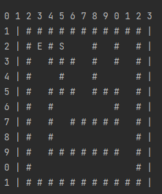
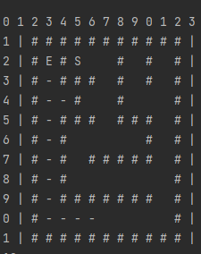
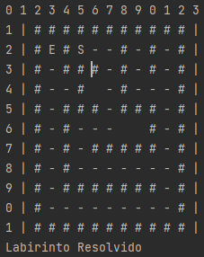
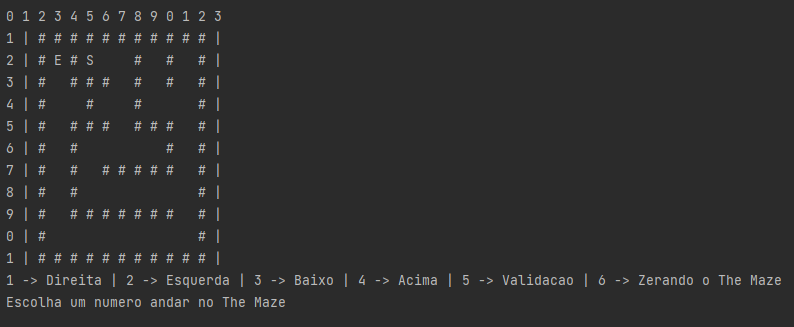
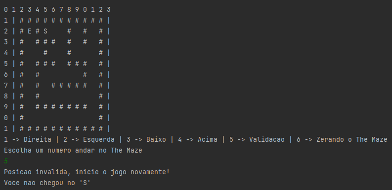
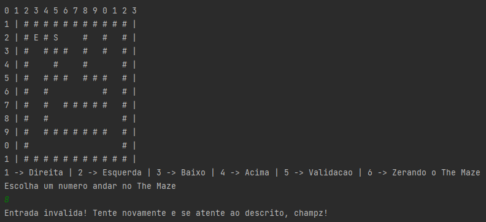
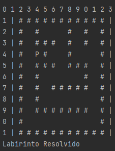

# Projetos de Estrutura de Dados
Coletânea de trabalhos executados dentro da matéria de Resolução de Problemas Estruturados em Computação, do terceiro semestre no ano de 2022.

* Trabalho 1 - Labirinto em Pilha
* Trabalho 2 - Labirinto em Lista
* Trabalho 3 - Linked List 
  
~~~java
public class LinguagemUtilizada {
	public static void main(String[] args) {
               System.out.println(“Todos os trabalhos executados foram desenvolvidos utilizando Java.”);
         }
}
~~~
---
## Trabalho Prático 1 - Labirinto em Pilha 
Este primeiro trabalho foi executado utilizando a estrutura de dados chamada de pilha. 

O objetivo deste programa é a criação de uma estrutura executada em pilha do qual o computador é capaza de chegar de um ponto até outro dentro do labaritinto criado na liguagem Java.

O programa já inicia na casa **E [3][2]** e consegue através de uma sequência programada encontrar seu próprio caminho de saída na casa **S [5][2]**:

Conforme o labirinto avança é demonstrado o caminho traçado pelo computador para chegar no "S":

Até que finalmente chega ao seu destino final, assim completando o percurso e finalizando o programa como sucesso:

---
## Trabalho 2 - Labirinto em Lista
Este segundo trabalho foi executado utilizando a estrutura de dados chamada de Lista.

Se trata do mesmo trabalho de Pilha acima, contudo a diferença é que dessa vez é utilizado Lista para executar a ação de caminho no labirinto e adicionando o comando de caminhar no labirinto para o usuário e não para o computador.  

O programa também inicia na casa **E [3][2]** do qual desta vez nas mãos do usuário, inserindo informações do teclado, consegue chegar ao valor **S no mapa do labirinto [5][2]**:

>É importante ressaltar que a diferença deste trabalho para o anterior é que mesmo o usuário inserindo a informação de caminho no teclado, ela não aparece no mapa, isto porque estamos utilizando Lista, então o que o sistema faz é armazenar os valores informados e depois comparar no final (ou o quando o usuário aperta o **5**) se eles batem com as coordenadas do labirinto até o valor **S**

O usuário informando os valores, caso aperte o **5** para validação e as informações não estejam corretas, essa informações será exibida à ele:

Zerando assim toda informações e o labirinto começando com a lista limpa para novas informações.

E caso ele coloque uma informação diferente do que o *menu* requer, essa será a informação exibida: 

Caso ele faça tudo corretamente e os valores da lista esteja de acordo com os valores da matriz, esse será o resultado: 

## Trabalho 3 - Linked List 
Este primeiro trabalho foi executado utilizando a estrutura de dados chamada de pilha. 

O objetivo deste programa é a criação de uma estrutura executada em pilha do qual o computador é capaza de chegar de um ponto até outro dentro do labaritinto criado na liguagem Java.

O programa já inicia na casa E [3][2] e consegue através de uma sequência programada encontrar seu próprio caminho de saída na casa S [5][2]:

